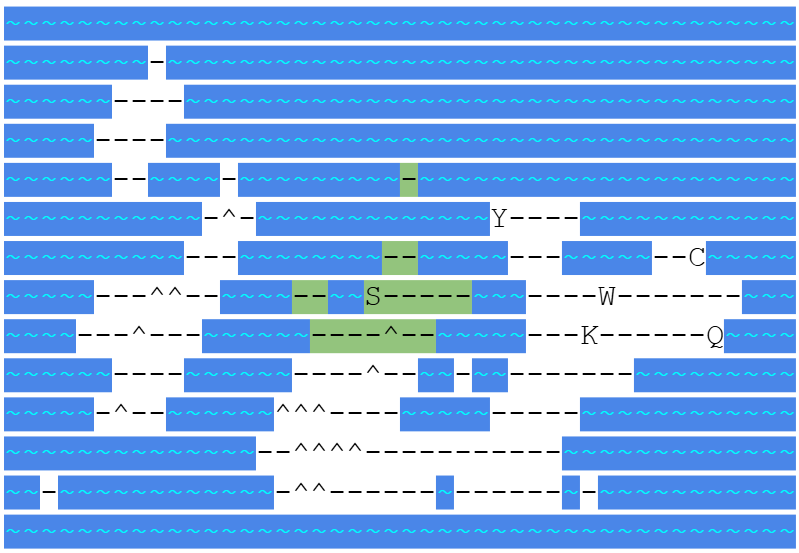
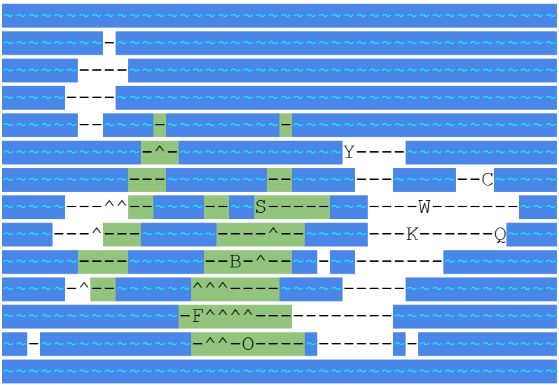
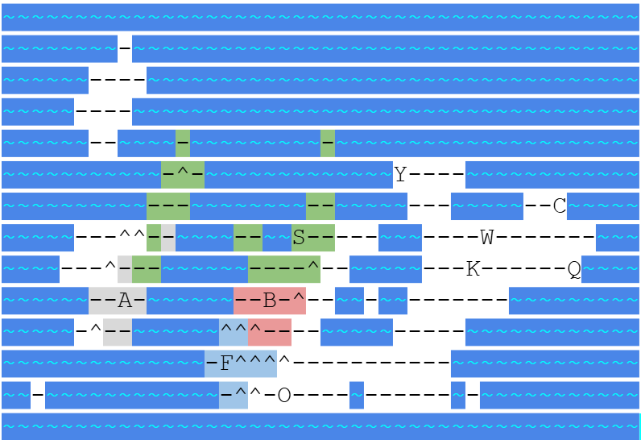

# The Bunny Federation of Dargia

The Bunny Federation of Dargia was a short lived polity led by the [Saltfurs](../races/bunnies.md) of [Dargia](../locations/dargian_isles.md) to unite the Saltfurs and the arriving continental bunnies
under a single banner. The influx of migrants from the continent would see the bunnies ranks swell and they would build a small kingdom around the western strait.
The Saltfurs managed to keep the tribes in federation for a time, but they were not blessed by [Bathem](../people/individuals/bathem.md) during his ascension and many continental bunnies
questioned if that made them unfit to rule. As the continental bunnies grew in strength on Dargia they began to push for the Federation to follow their ways.

This infighting would give the [Korgin's Rest](../locations/city_korgins_rest.md) and their [Green Scale](../races/kobolds.md) allies an oppurtunity to launch an invasion which stripped away much of the Federation's
eastern territory and lead to the destruction of [Ashaven](../locations/city_ashaven.md), the [Flight of the Ashfurs](../events/flight_ashfurs.md) and the isolation of the Frostfurs.
As a result, the Federation would collapse with each of the bunny tribes being ruled from [Earshaven](../locations/city_earshaven.md), [Bloodshaven](../locations/city_bloodshaven.md),
[Frosthaven](../locations/city_frosthaven.md), and [Newhaven](../locations/city_newhaven.md) separately.

The Founding of the Bunny Federation

The Bunny Federation's greatest extant

The Fractured Bunny Federation
