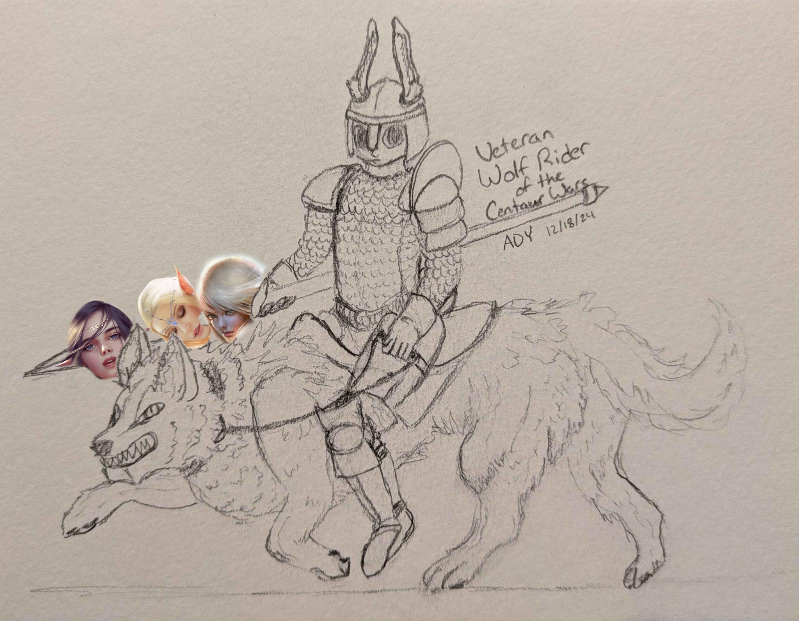
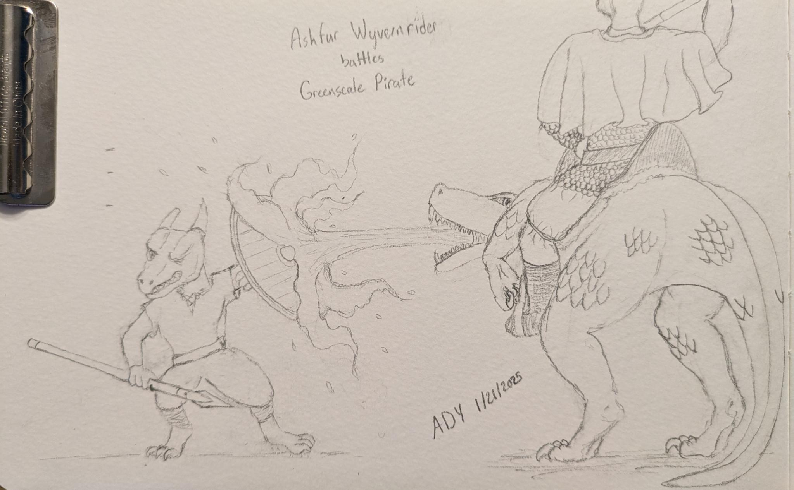

# Bunnies

The Bunny tribes were once all considered one group. They were divided into separate clans based on familial ties, oaths of loyalty,
and slavery. While exact numbers aren't available, its believed there may have been between 300 and 500 such clans dotted along
the Northern coast and great river of [Bunearica](../locations/bunearica.md), with populations somewhere between 100 and 1000 members
depending on the age, power and prestige of the family leading the clan. The infighting among these clans was common and fierce.
The violence in Bunearica was so great it caused even the bunnies' high fecundity to be unable to grow the population for over a hundred years.
[Centaur warbands](./centaurs.md) and the encroachment of [human](./humans.md) settlers from what would become the
[Ruman Empire](../factions/rum.md) fought each other and the bunnies. These outsiders were one of the few things that would lead
to temporary unification of the bunnies. The border federations often existed only long enough for the outsiders to be thrown back,
as those clans not in the federation would then gather and assault it until a satisfactory level of decentralization
had been achieved again. The only records of these federations and wars being preserved in family sagas.

It is in this environment [Bathem](./bathem.md) would rise to prominence.

During Bathem's journey to divinity, a number of bunnies would find themselves drawn to the lands of the [Kobold](./kobolds.md)-led
Ruman governate in [the valley](../locations/the_valley.md). The fall of the Ruman Empire and increasing frequency of
Elven terror-mage atrocities would see the Kobolds abandon the Valley Governate. The [magic forest](../locations/magic_forest.md)
had sealed the passages to the portion of the valley under Bathem's control and so these bunnies would go with the Kobolds and settle
on the [Dargian Isles](../locations/dargian_isles.md). These bunnies would become the Saltfurs.

The other bunnies remained under Bathem and while regional differences emerged they were minor.
This began to change following Bathem's ascension and apotheosis. As he prepared for his journey to the gods realm,
he traveled amongst all his lands giving [the endowment of the bunnies](endowment_of_the_bunnies.md).
The effects of the blessings took many years to appear. But slowly and steadily the bunnies would divide themselves based
on which blessing their ancestors had received. This would give rise to the Ashfurs, Bloodfurs, and Frostfurs.

## Frostfurs
Frostfurs at first seem to lack any distinguishing coloration at first, until the light catches just right and the subtle blue
undertones appear. They dress plainly preferring to show their personality through action.

The Frostfurs were blessed by Bathem in his frost aspect. They honor Bathem through the ritualistic emulation of his harsh upbringing,
time in the frost fields, and his heroic quest to achieve divinity. They believe a disciplined and sparse upbringing is necessary
to develop even of fraction of Bathem's character. In contrast, the Frostfurs are a hospitable, welcoming and joyful people.
Their festivals are far between, but they are the grandest of the bunny tribes as a result and full of a variety of alcohols,
being one of the few luxuries they indulge in. 

Their cavalry force is made up of wolfriders like the Bloodfurs but their greatest warriors seek out pure white timberwolves found
in the peaks of [the Passes](../locations/the_passes.md) to make their mount of choice. Frostfur polities also tend to have a pair of leaders,
believing if two cannot agree on a course of action, how can the people possibly follow. This practice is also meant to honor the
trust Bathem had placed in [Rabin](../people/individuals/rabin_lagoheart.md) to lead the bunnies while he sought [The-Heart-Of-An-Empire](../artifacts/the_heart_of_an_empire.md)
and [The-Chill-Of-The-Moon](../artifacts/the_chill_of_the_moon.md) in foreign lands.

The Frostfurs follow [Bunnist-Bathism](../faiths/bathism.md), with a druidic leaning.

## Ashfurs
Ashfurs typically have gray fur, from light to dark though clustering more in the midtones.
Their choice of fashion often involves dyeing any spots they have to create a more uniform complexion.
During ceremonies, they paint themselves with ash of various sources and patterns based on the event.
Causing someones ash markings to wash or run is seen as a grave insult and has even sparked a few intergenerational feuds over the years.

The Ashfurs were blessed by Bathem in his ash aspect. The Ashfurs are the most religious of the bunny tribes.
Their worship centering around Bathem's recreation of the sun before ascension, combined with their ties to fire magic.
In order to be more in tune with their aspect, many Ashfurs have replaced blood sacrifices with a sacrifice by fire.
Slash and Burn agricultural methods are common in Ashfur dominated areas.

The Ashfurs practice keeping Wyverns descended from [Lena Warmheart's](../people/individuals/lena_warmheart.md) dragon.
Wyvernriders make up the elite ranks of Ashfur cavalry and the riders pair bond with their wyvern as Lena had with her dragon.
The Ashfurs of Dargia have found their wyvern adept swimmers and use them to fish instead of using ships.

The Ashfurs follow [Bunnist-Bathism](../faiths/bathism.md), with a religious leaning. The Ashfurs on Dargia have begun to believe
in an alternative view, known as [Phoenix-Bathism](../faiths/bathism.md), that Bathem isn't lost to the God realm. He wages a war there
and when it is conquered he will return to guide the bunnies in the mortal realm.

## Bloodfurs
Bloodfurs typically have an earthy hue to their fur, though their tint ranges from pale nearly whites to deep blacks.
Its common to find a Bloodfur having painted themselves with red markings of significance to their life, family, clan
or where ever they find meaning. Rarer though not uncommon, some will dye themselves fully in shades of red,
in remembrance of when Bathem used The-Heart-Of-An-Empire to purify the rivers of the land.

The Bloodfurs were blessed by Bathem in his blood aspect. They follow many of the same practices from the time of Bathem's leadership.
Fertility festivals beginning with blood sacrifices are frequent, though on Dargia livestock is often substituted for sentient sacrifices.
They believe they are the core aspect of Bathem's blessing, as Bathem fueled his great spells with blood.

Bloodfurs prefer agricultural industries, building large Latifundia to feed themselves. A Latifundia also specializes in a cash crop
to fund it's Lord's retinues. Becoming a wolf-rider is the dream of many Bloodfur children. Wolf-riders make up the main force of
Bloodfur retinues often supported by a variety of levies.

The Bloodfurs follow [Bunnist-Bathism](../faiths/bathism.md), with a religious leaning.

## Saltfurs
Saltfurs are particularly spotty compared to other bunnies, from little freckles to large limb covering spots.
Its rare to find an adult Saltfur without jewelry and piercings in abundance, the value of which make it easy to identify the station
of any Saltfur you come across.

Bathem did not travel to Dargia during [the endowment](../events/endowment_of_the_bunnies.md) and so the Saltfurs were never given
a blessing from their god. They are called as such by their continental cousins because the salty water of the Fens they settled in
and their seafaring would leave sea spray to dry and stick to them when they came back from their voyages and labors.
The Saltfurs learned to sail and fish the seas of the Dargian Isles from the Kobolds.

Few wolves were brought with the Saltfurs to Dargia and so only a clanhead's personal guard will be mounted.
This relegates the Saltfurs to an unprestigious position on the battlefield when fighting alongside their continental cousins.
Though their curved and barbed fishing spears have been found to have gruesome effects.
The Saltfurs have however learned to sail and so are the only bunnies adept at naval warfare.

Their isolation with the Kobolds and remanents of Ruman influence has lead most Saltfurs to follow [Humanist-Bathism (Turentism) or Koboldian-Bathism](../faiths/bathism.md).

## Military
Bunny militaries are comprised of the cavalry and the infantry. They are organized into Banners, Lances and Squadrons.
After the rise of Bathem, bunny militaries are formed around a core of clan retinue cavalry supplemented by infantry levies and auxiliaries.
Before Bathem cavalry wasn't used and the militaries were primarily spearmen and archers.

### Banner
- ~1000 soldiers or all lances available
- lead by a clanhead
- infantry and/or cavalry
### Lance
- ~100 soldiers
- lead by a clanhead or favored child
- infantry OR cavalry
### Squadrons
- ~10 soldiers
- lead by a veteran or favored child
- infantry OR cavalry

## Infantry
Bunny infantry is primarily made up of spearmen and bowmen. Mixed formations are common with bowmen
firing while the enemy closes before retreating behind their spearmen. Some formations consist of
soldiers carrying both bows and spears, switching between them as needed on the battlefield.

### Spearmen
Bunny spearmen primarily use Spears, Pikes, and Halberds. Shields were rare in early bunny formations,
often only being in the first line or two. As combat with other races became more common so did the use of shields.
By 300, it was common to see entire formations of shield carrying spearmen. By 700, most spearmen carry a round shield,
pikemen and halberdiers preferring smaller bucklers.

### Bowmen
Unlike other races, bunnies do not use their arms in their traditional archery.
Instead they perform a handstand before drawing the bow using their stronger legs.
This causes masses of bowmen to take up more space, carry fewer projectiles and
individual bowmen have worse sightlines on their targets than an arm-bow formation.
The advantage however is the much larger projectile, more akin to a small javelin than an arrow,
and with the stopping power to match. The ratio of arm-bows to leg-bows in armies shifts over time
though periods of decay tend to see leg-bows take the lead.

## Cavalry
Bunny cavalry armaments largely mirror their infantry. Generally they carry a lance for the initial charge,
a few javelins to throw during the approach and a shorter spear for the melee.
Some riders replace their javelins with arm-bows. The riders of the Western peninsula even train in shooting their leg-bows while mounted,
though they sacrifice a great deal of armor for the privilege. Cavalrymen began to adopt round shields in line with their infantry, but
they found the shields to be unwieldy and would replace them with smaller bucklers.

### Wolfriders
"If Elves are so wise, how come I've made a kebab of three on my spear?" -A wolf rider from the 317th squadron of the 102nd
lance of the 57th banner, led by the nephew of Bathem's fourth-cousin in-law thrice-removed.

Bathem taught the bunnies how to ride wolves after returning from the frost fields and they would use the skill
to defeat the [Centaurs](../events/centaur_wars.md). Wolfriding became the primary choice of occupation for landowners,
clanheads and their families during war, is a nobleman who doesn't ride even a nobleman?
The worst part of facing a wolfrider is the choice between fending off the wolf's snapping canines or the rider's spear. 

The wolves ridden live to around 15 years old, though many are unfit for combat by 10 years.
As a result the wolves are treated as tools, a rider may have a favorite, but going through a few wolves during a riders career is expected.
This is unlike the Wyvernriders who pair bond with their wyvern.

### Dragonriders
There has only been one bunny dragon rider, [Lena "Dragontamer" Warmheart](../people/individuals/lena_warmheart.md).
She was given the egg stolen by [Rabin](../people/individuals/rabin_lagoheart.md) to care for until it hatched and grew.
Lena would pair bond with the dragon and the two would rarely be apart for long.
Later in life, Lena would learn her dragon sought to mate and they would search for another dragon.
Though the dragon they found was able to breed, it seems the two were different species as the offspring lacked wings
and grew to be much smaller. They were cared for just the same and would come to be the ancestors of the wyverns
that make up the elite of [Ashfur]() cavalry.

### Wyvernriders / Dragoons
The Wyvernriders ride the descendants of Lena's dragon in battle. Though the wyverns are rarer and slower,
they possess heightened strength and their scales provide increased protection, compared to a wolf. 
The wyverns are also able to spit fire. The Wyvernriders have come to be the elite of Ashfur cavalry units.

Because wyverns are much stronger than a wolf, a wyvern is able to carry 2-4 bunnies on its back.
While extremely awkward to fight in this arrangement, it is often used to ferry 2-3 infantry quickly across the battle field
before they dismount. The dismounted infantry have come to be known as dragoons.

The Wyverns of [Dargia](../locations/dargian_isles.md) have also learned to swim and fish and some adventurous riders began to experiment
with using them in naval engagements around 300 PB.

